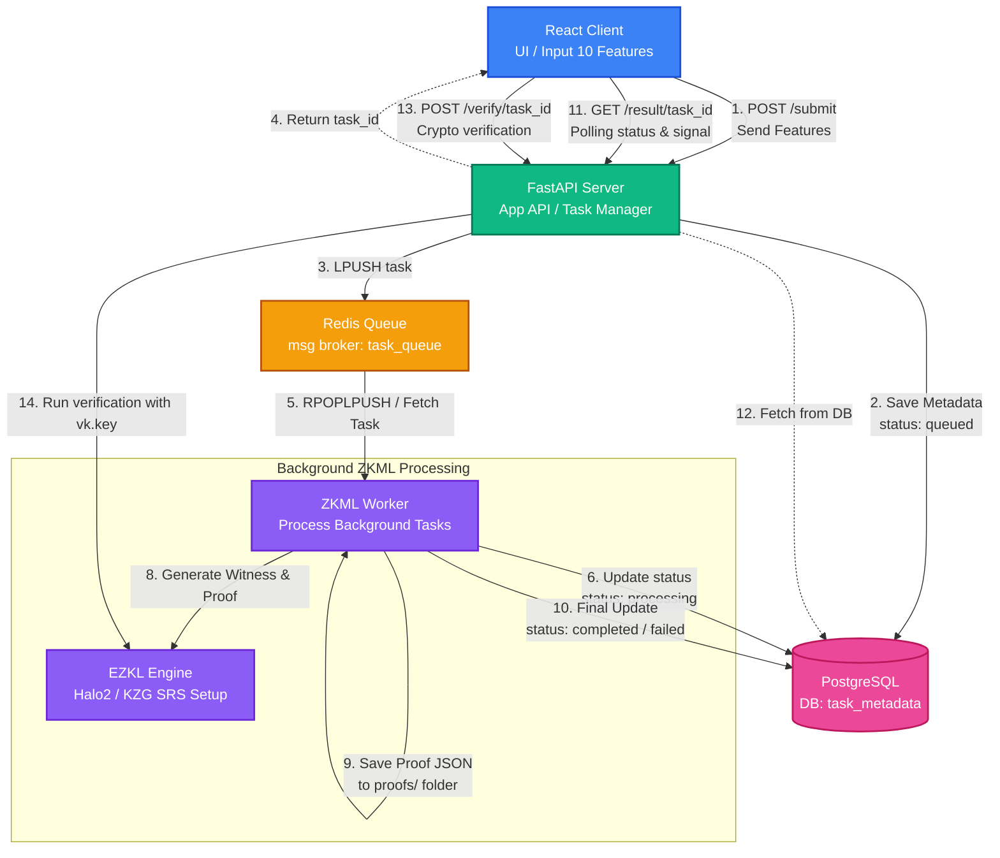

# ZKML Trading System

Курсовой проект по реализации системы конфиденциального машинного обучения (**Zero-Knowledge Machine Learning**) для генерации и верификации торговых сигналов на основе нейросети MLP.

Система позволяет доказать, что определенный торговый сигнал (BUY/SELL/HOLD) был сгенерирован именно конкретной ML-моделью на основе валидных входных данных, не раскрывая при этом веса самой модели (они остаются `private`, в то время как входы и выходы являются `public`).

##  Архитектура системы

Проект разделен на две основные части: клиентскую (React) и серверную (FastAPI + Celery-like Redis Worker + EZKL).

```
├── client/                 # Frontend на React (Vite)
└── ezkl_models/            # Backend и ZK-схемы
└── trade_models/
├── data/           # Исходные датасеты и файл статистик нормализации
├── keys/           # Ключи доказательства (pk.key) и верификации (vk.key)
├── proofs/         # Сгенерированные доказательства (ZK-Proofs)
├── settings/       # ONNX-модель, скомпилированная схема и SRS параметры
└── scripts/        # Исполняемые скрипты (FastAPI, Worker, Setup)
```

### Компоненты:

**Client (React + Vite):** Интерфейс пользователя. Позволяет вводить или генерировать случайные признаки рынка (10 фичей), отправлять их на обработку, отслеживать статус задачи в реальном времени, скачивать файлы пруфов и запускать криптографическую верификацию.

**App Server (FastAPI):** Асинхронный API. Принимает задачи, сохраняет метаданные в PostgreSQL, пушит задачи в очередь Redis и предоставляет эндпоинты для скачивания пруфов и их проверки.

**Queue (Redis):** Брокер сообщений для асинхронной обработки тяжелых ZK-операций. Использует структуру данных списка (`task_queue`) и хэши для хранения стейта задач.

**ZKML Worker:** Изолированный бэкграунд-процесс. Извлекает задачи из Redis, нормализует фичи по формуле (X - mean) / std, генерирует свидетельство (Witness), вычисляет торговый сигнал, создает криптографический Proof (через EZKL) и обновляет статус в PostgreSQL и Redis.

**EZKL Engine:** Библиотека, компилирующая PyTorch модель в арифметическую схему над криптографическим протоколом Halo2 с использованием KZG SRS (Structured Reference String).

##  Быстрый старт и развертывание

### Предварительные требования
* **WSL2** (Ubuntu / Debian)
* **Python 3.10+**
* **Node.js & npm**
* **PostgreSQL** и **Redis**, запущенные на локальной машине

### 1. Настройка ZKML Backend

Перейдите в директорию бэкенда и настройте окружение:
```bash
cd ezkl_models/trade_models
python3 -m venv venv
source venv/bin/activate
pip install -r ../requirements.txt
```

### Шаг A: Генерация модели и статистик
Скрипт создает PyTorch модель `TradingMLP` (с зафиксированными весами), экспортирует её в ONNX и рассчитывает параметры `mean`/`std` для нормализации данных:
```bash
python scripts/gen_model.py
```

### Шаг B: Криптографический Setup схемы (EZKL)
Скрипт очищает старые артефакты, компилирует схему с параметром видимости весов `private`, генерирует KZG SRS (параметр `logrows = 17`), а также создает пару ключей Prover Key (`pk.key`) и Verifier Key (`vk.key`):
```bash
python scripts/ezkl_setup.py
```

* Примечание: Процесс может занять некоторое время в зависимости от мощности процессора.

### Шаг C: Запуск Базы Данных и Redis
Убедитесь, что PostgreSQL (с базой `zkml_db`) и Redis запущены. При необходимости обновите DSN подключения в коде.

### Шаг D: Запуск FastAPI Сервера
```bash
python scripts/main.py
```
Сервер запустится на `http://127.0.0.1:8000`.

### Шаг E: Запуск Очереди Воркера
В новом терминале (активировав `venv`):
```bash
python scripts/worker.py
```

### 2. Настройка React Клиента

В новом терминале перейдите в папку клиента, установите зависимости и запустите локальный сервер разработки:

```bash
cd client
npm install
npm run dev
```
Интерфейс будет доступен по адресу, указанному Vite (обычно `http://localhost:5173`).

##  Описание API Эндпоинтов

* `POST /submit` — Принимает массив `features` (10 чисел), ставит задачу в queue Redis, возвращает `task_id` со статусом `queued`.
* `GET /result/{task_id}` — Возвращает статус задачи (`queued`, `processing`, `completed`, `failed`), а также сигналы (`buy`, `sell`, `hold`) и имя файла доказательства.
* `GET /proof/{filename}` — Скачивание сгенерированного JSON-файла доказательства (Proof).
* `POST /verify/{task_id}` — Запуск криптографической верификации бэкендом с использованием публичных инпутов/аутпутов и `vk.key`. Возвращает `{"verified": true/false}`.
* `GET /tasks` — Получение истории последних 100 задач (с поддержкой пагинации).
* `DELETE /tasks/{task_id}` — Удаление задачи из БД/Redis и очистка соответствующего `.json` файла доказательства из хранилища.

##  Настройки видимости EZKL (Visibility Settings)
В целях защиты интеллектуальной собственности и торговой стратегии в проекте настроена следующая конфигурация схемы:
* **Параметры модели (Параметры/Веса):** `private` — скрыты внутри доказательства, никто не может узнать структуру коэффициентов сети.
* **Входные данные (Признаки):** `public` — проверяющая сторона видит, на основе каких рыночных данных делался расчет.
* **Выходные данные (Сигнал):** `public` — результат работы сети полностью открыт для верификации.

## Визуализация архитектуры проекта

